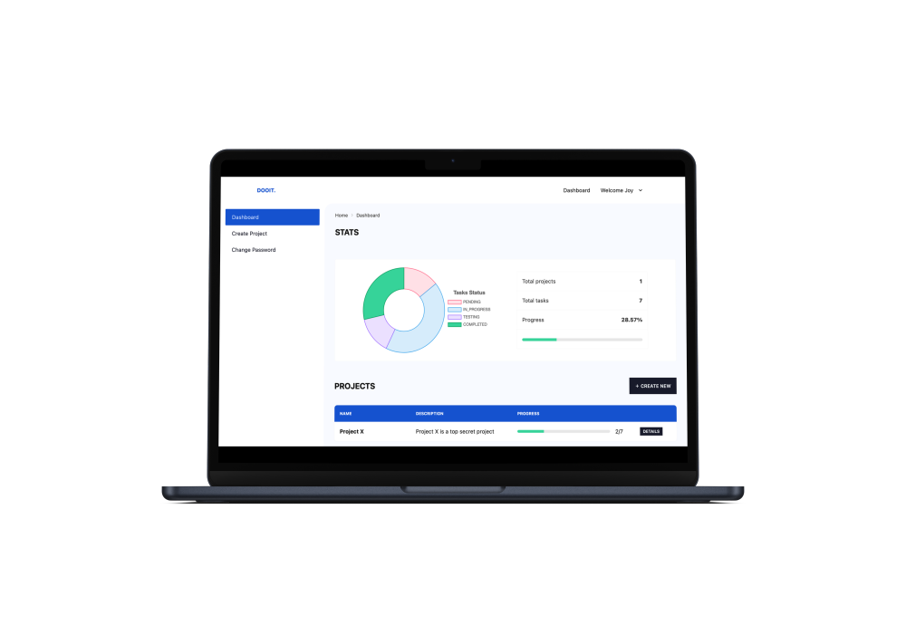

<h1 align="center" id="title">Dooit</h1>

A kanban board with a sleek design and intuitive UX.



## Live Demo
**WEBSITE** - [https://dooit.vercel.app/](https://dooit.vercel.app/)


## Features
- Beautiful drag and drop kanban board
- Create and manage multiple projects
- Add/Remove users from projects on the fly
- Get tasks progress and other statistics
- Optimised for both mobile and web

## Environment Variables

To run this project, you will need to add the following environment variables.

For backend add the following in the .dev.env and .prod.env files

`MONGODB_DATABASE_URL`

`JWT_SECRET`

For frontend add the following in the .env.local file

`NEXT_PUBLIC_GRAPHQL_SERVER_URL`

## Run Locally

Clone the project

```bash
  git clone https://github.com/joysamaddar/dooit.git
```

### BACKEND
- Install the dependencies
```bash
  cd backend
  npm install
```
- Create .dev.env file (Refer to .example.dev.env file)
- Run the development server
```bash
  npm run start:dev
```
### FRONTEND
- Install the dependencies
```bash
  cd frontend
  npm install
```
- Create .env.local file (Refer to .example.env.local file)
- Run the development server
```bash
  npm run dev
```

## Tech Stack
- **Server:** NestJS, TypeScript, Apollo Server, TypeORM, MongoDB
- **Client:** NestJS 13, TypeScript, Apollo Client, TailwindCSS, SASS, DaisyUI

## Feedback
If you have any feedback, please reach out to me at joysamaddar123@gmail.com
